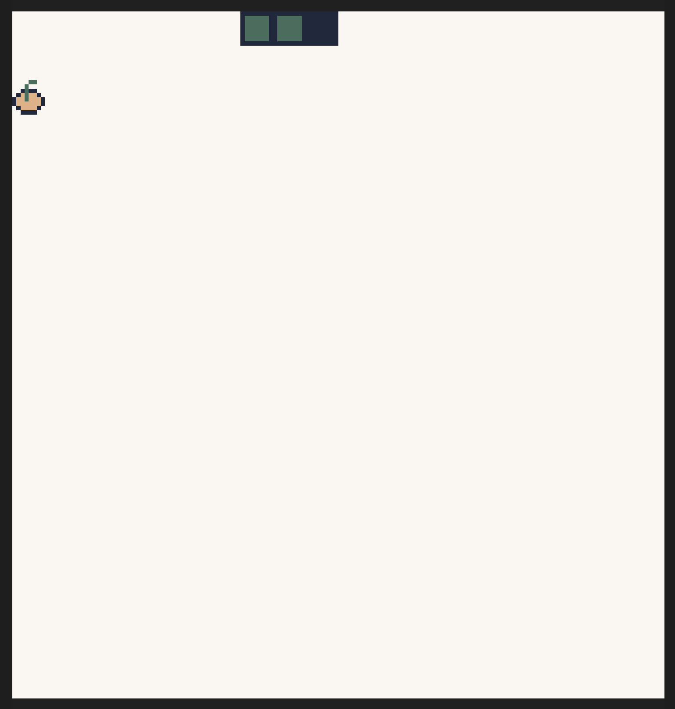

# MoonBit WebAssembly Snake

This is a simple snake game written in MoonBit, a language that compiles to WebAssembly.

MoonBit version is `0.1.20240929`.



## Install dependencies

```bash
moon install
npm install
```

## Build

```bash
moon build --target wasm
```

## Run

```bash
npx wasm4 run target/wasm/release/build/snake.wasm
```

## Publish

```bash
npx wasm4 bundle --html game.html target/wasm/release/build/snake.wasm
```
